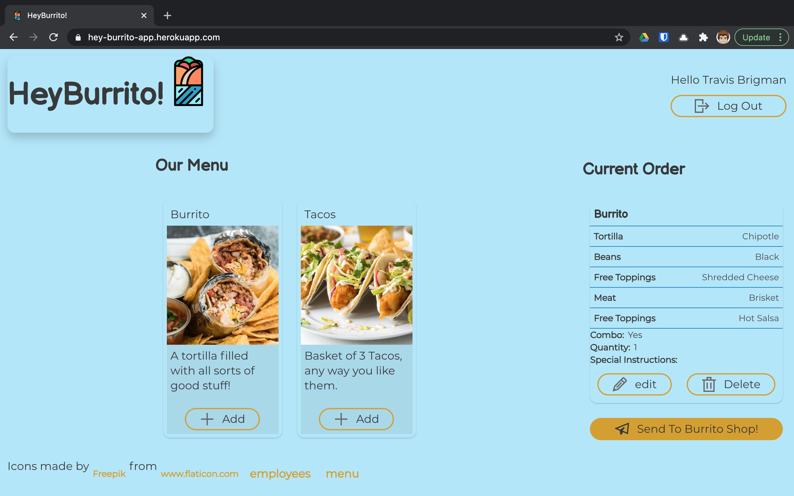
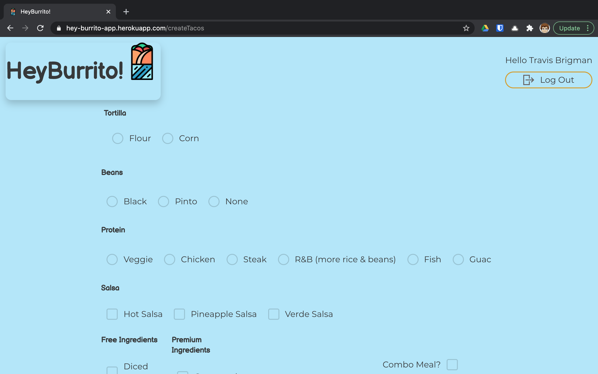
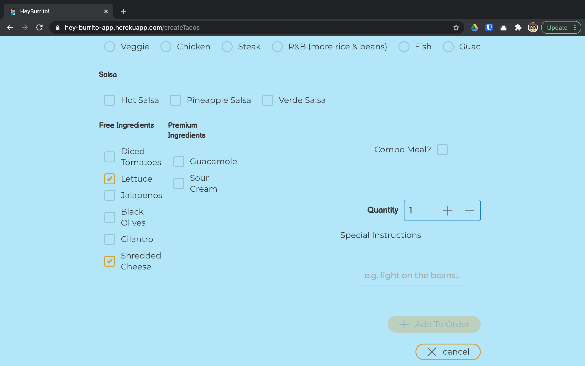
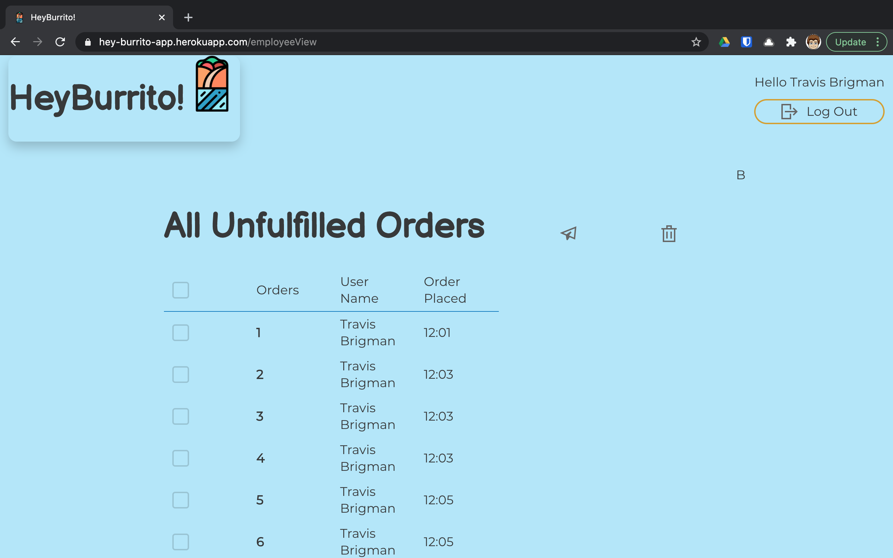

## HeyBurrito!

##### A demo burrito ordering app
---

The intention of the app is for a user to log in select and customize menu items. When they click "Send to Burrito Shop" That adds the order to a queue in the employee view section of the app. From there, an employee can either delete or e-mailed to prescribed address. The idea being the restaurant could send orders to a web-enabled printer that would print hard copies of orders to be fulfilled.

##### Setup
---
This project was bootstrapped with [Create React App](https://github.com/facebook/create-react-app).

1. Clone this repository
2. `cd` into the directory
3. Install the necessary packages:
    - `npm install`
    - `npm i --save react react-dom react-router-dom`
    - `npm install grommet styled-components --save`
    - `npm install grommet-icons`
    - `npm install emailjs-com --save`
    - `npm install json-server`
4. `mkdir api` and `touch database.json` to create the database
5. Copy and paste sample api below into the database
6. Run `json-server -w database.json -p 8088` from the api directory
7. In a separate terminal, run `npm start` from the repository directory

N.B. EmailJS can be used for free, but requires an account. Sign up [here](https://www.emailjs.com/).

##### Screen Shots
---

